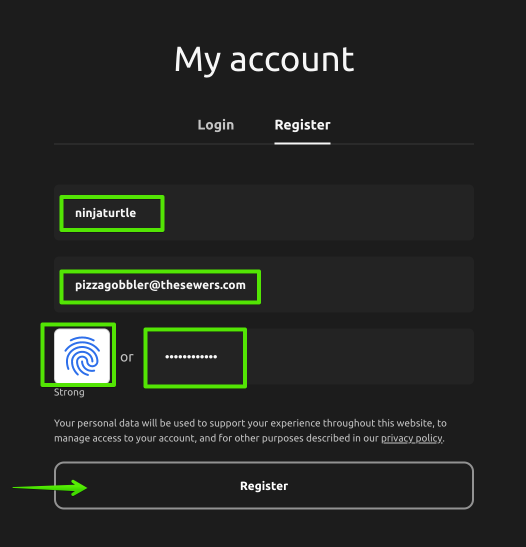
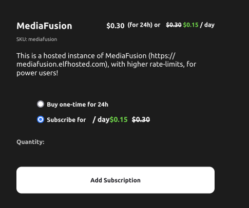

# MediaFusion on ElfHosted

[ElfHosted](https://elfhosted.com) is a geeky PaaS, which provides "one-click" hosting of popular apps, as an alternative to selfhosting.

In addition to hosting https://mediafusion.elfhosted.com (*one of potentially many community instances, not affiliated*), ElfHosted provide "private" instances of MediaFusion, which can be customized for your own use.

> [!NOTE]
> While ElfHosted may host a community instance of MediaFusion, it also hosts community instances of **other** [Stremio add-ons](https://elfhosted.com/stremio-addons/) for the benefit of the wider community, and so should not be construed to be affiliated with the MediaFusion project in any way.

This page explains how to setup MediaFusion on ElfHosted, along with (optionally) qBittorrent or RDTClient, for non-debird downloads to storage.

New users get $10 free credit ("ElfBuckz"), so you can "dial in" your setup before committing.

## Setup account

To start, go to https://store.elfhosted.com/my-account/, and register a new account. Pick a username (*lower case, starting with a letter*), as illustrated below:

Once your account is setup, confirm your free $10 ElfBuckz, at https://store.elfhosted.com/my-account/account-funds

## Add apps

### MediaFusion

From the ElfHosted store, add a subscription to [Mediafusion](https://store.elfhosted.com/product/mediafusion) to your cart:

### Optional extras

#### RDTClient 

RDTClient implements a qBittorrent API, so that it can be used with Radarr / Sonarr as a download client.

If you'd rather download (and store) your torrents from debrid providers than stream them directly, then RDTClient will do the job.

Add [RDTClient](https://store.elfhosted.com/product/rdtclient) to your cart from the store.

#### qBittorrent (BYO VPN required)

If you'd like to download torrents the "traditional" way (no debrid services), then you'll need a qBittorrent client. 

ElfHosted requires users to BYO VPN credentials on bittorrent clients, so pick the appropriate variant of qBittorrent from the [store's catalog](https://store.elfhosted.com/product-category/download-media/qbittorrent), and enter your VPN credentials.

> [!TIP]
> Don't have a VPN yet? ElfHosted's qBittorrent client has been tested to work best with [PrivateInternetAccess](https://fnky.nz/support-me-when-you-buy-pia) (referral link). 
> 
> You can usually pick up a subscription for < $2/month.

#### Storage

If you intend to download media using either qBittorrent or RDTClient, you'll need somewhere to store it. ElfHosted provides 100GB free storage, and thereafter you "subscribe" to storage on a daily basis. 

> [!WARNING]
> Storage can be increased in 1TB "chunks", but can never be shrunk - if you later need to reduce your storage, it has to be destroyed and recreated.

Add "[ElfStorage](https://store.elfhosted.com/product/elfstorage)" to your cart from the store, as necessary (*you can add increase later*).

### Checkout

Check out of the store, providing the necessary details, and opting to pay with your ElfBuckz balance.

Upon completion, your ElfHosted dashboard will be deployed at `https://<your username>.elfhosted.com` (*you'll receive an email*), and your MediaFusion instance will be available at `https://<your username>-mediafusion.elfhosted.com`. (*As well as any other apps you purchased*)

### Configure MediaFusion

Configure MediaFusion as you normally would, through your browser, and install the addon into Stremio.

