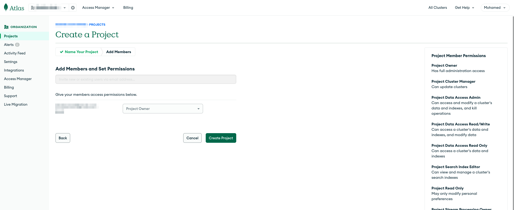
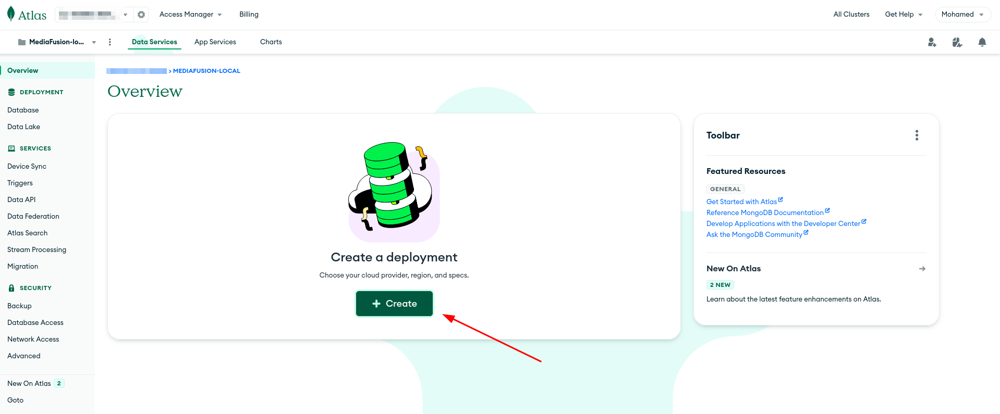
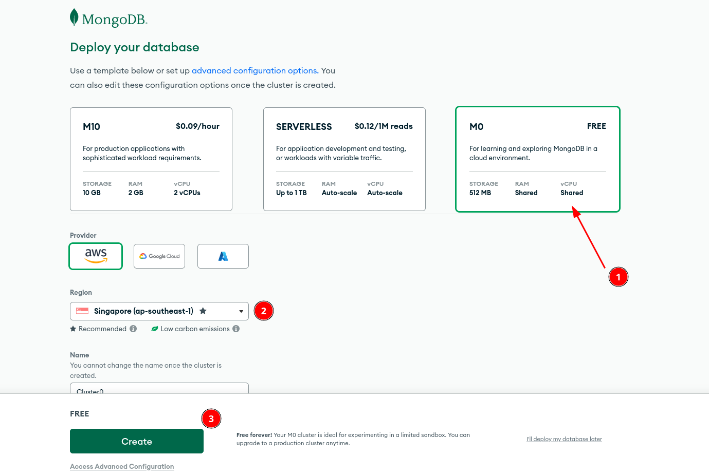
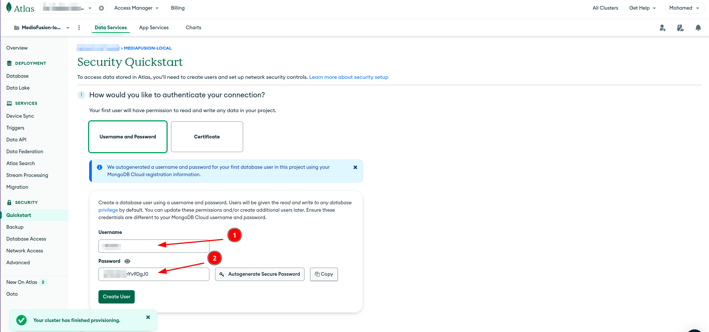
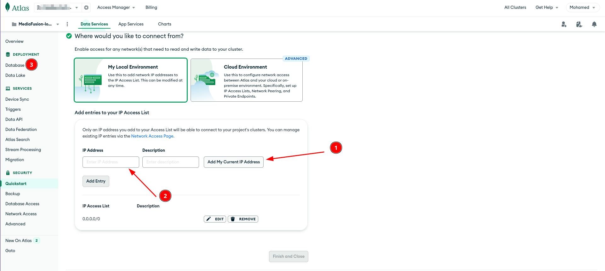
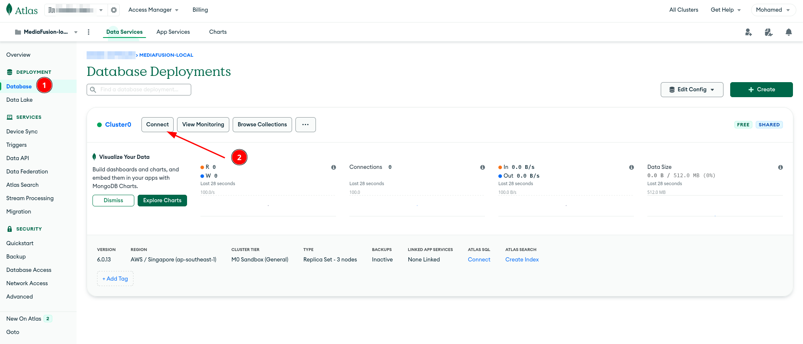
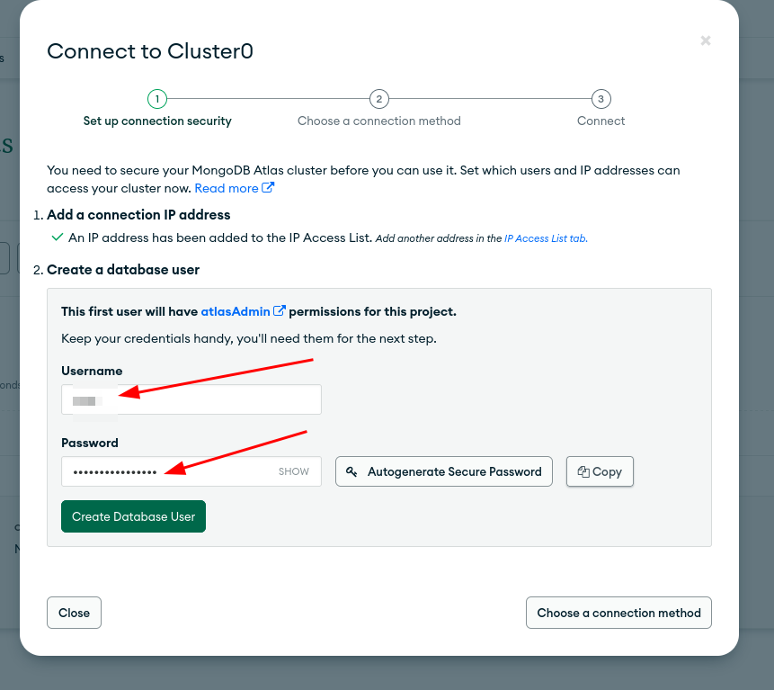
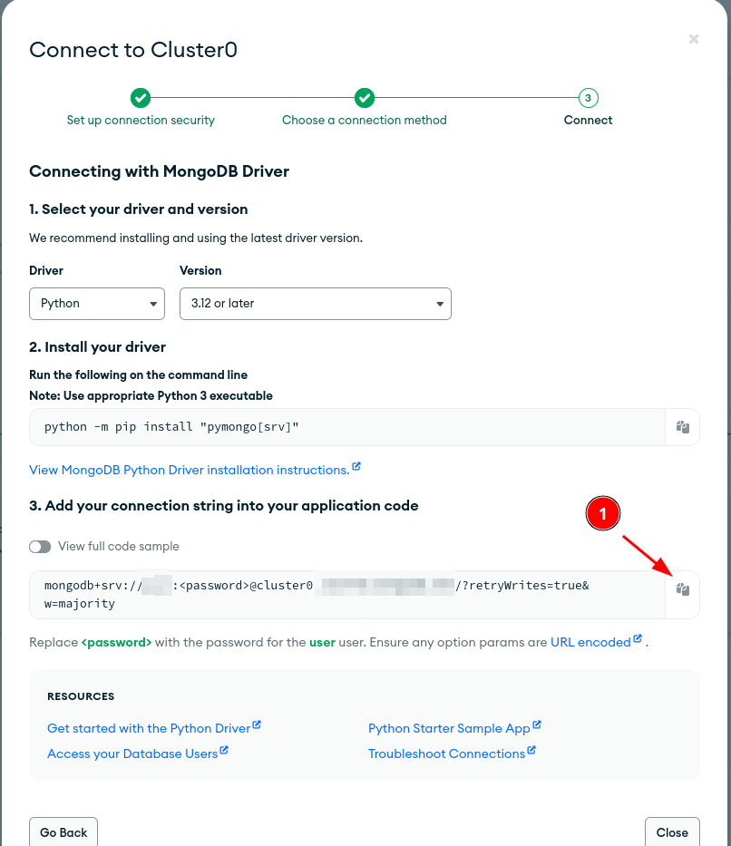

# Setting up a Free MongoDB Atlas Cluster

This guide will walk you through setting up a free MongoDB Atlas cluster which can be used as a database for your applications.

## Step 1: Sign Up or Log In to MongoDB Atlas

Go to the [MongoDB Atlas](https://www.mongodb.com/cloud/atlas) website and sign up or log in to your account.

## Step 2: Create a New Project

- After logging in, create a new project by clicking the "Create a New Project" button.
 
- Give your project a name and add any members if you're working as part of a team.

## Step 3: Create a Free Cluster

- Inside your new project, click the "Create" button to create a new cluster.
 
- Choose the "Free" cluster tier which provides you with 512 MB of storage.
 
- Select your cloud provider and the region closest to your application users for optimal performance.
- Click "Create" to provision your free cluster.

## Step 4: Configure Database Access

- Navigate to the "Database Access" section under the "Security" menu on the left-hand side.
 
- Add a new database user with a username and a secure password. Remember these credentials as you'll use them to connect to your database.

## Step 5: Configure Network Access
- Go to the "Network Access" section under the "Security" menu.
 
- Click "Add IP Address" and either add your current IP address or allow access from anywhere "0.0.0.0/0" (not recommended. Know what you're doing).

## Step 6: Connect to Your Database

- Once your cluster is provisioned, click the "Connect" button next to your cluster.
 
- In case if you're not setting up IP Whitelist and DB User, you can see the below screen.
 
- Select the "Drivers"
 
- Choose Python as your driver.
 
- Copy the provided connection string and replace `<password>` with the password of the database user you created.
 
