# MediaFusion 5.0 - Database ERD (v3)

## Overview

This document contains the complete Entity-Relationship Diagrams for MediaFusion 5.0, designed with:
- Integer auto-increment primary keys (`id`) for all tables
- Multi-provider metadata support (TMDB, TVDB, IMDb, MAL, Kitsu, **MediaFusion**)
- **Unified stream architecture** supporting: Torrent, HTTP, YouTube, Usenet, Telegram, External Links
- Multi-provider rating system (IMDb, TMDB, Trakt, Letterboxd, Rotten Tomatoes, Metacritic, MediaFusion)
- Many-to-many stream-metadata relationships with file-level granularity
- User-created content and shareable catalogs
- Proper normalization for scalability

---

## Design Principles

### 1. Unified Stream Architecture
We use a **base stream + type-specific tables** pattern:

```
Stream (base table - common attributes)
├── TorrentStream (for BitTorrent)
├── HTTPStream (for direct HTTP/HLS/DASH URLs)
├── YouTubeStream (for YouTube videos)
├── UsenetStream (for NZB/Usenet)
├── TelegramStream (for Telegram - future)
└── ExternalLinkStream (for Netflix/Prime/Disney+ external links)
```

**Benefits:**
- Any media type (movie, series, TV) can have any stream type
- Single `StreamMediaLink` table for ALL stream-media relationships
- Easy to add new stream types without schema changes
- Consistent quality/language handling across all types

### 2. Multi-Provider Rating System
Ratings stored in a normalized table supporting:
- External providers: IMDb, TMDB, Trakt, Letterboxd, Rotten Tomatoes, Metacritic, Roger Ebert
- MediaFusion user votes (aggregated in separate table)

### 3. Provider-Based Metadata Attribution
- No `is_stub` flag needed
- Scraped data: `primary_provider_id` = tmdb/tvdb/imdb
- User-created: `primary_provider_id` = mediafusion, `created_by_user_id` set
- Auto-generated from streams: `primary_provider_id` = mediafusion

### 4. Trackers with Status
Announce URLs stored in separate `Tracker` table with status tracking (working/not working)

---

## 1. Metadata Providers

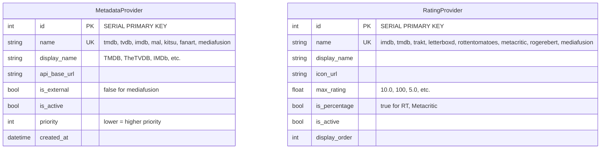
```mermaid
erDiagram
    MetadataProvider {
        int id PK "SERIAL PRIMARY KEY"
        string name UK "tmdb, tvdb, imdb, mal, kitsu, fanart, mediafusion"
        string display_name "TMDB, TheTVDB, IMDb, etc."
        string api_base_url
        bool is_external "false for mediafusion"
        bool is_active
        int priority "lower = higher priority"
        datetime created_at
    }
    
    RatingProvider {
        int id PK "SERIAL PRIMARY KEY"
        string name UK "imdb, tmdb, trakt, letterboxd, rottentomatoes, metacritic, rogerebert, mediafusion"
        string display_name
        string icon_url
        float max_rating "10.0, 100, 5.0, etc."
        bool is_percentage "true for RT, Metacritic"
        bool is_active
        int display_order
    }
```

---

## 2. Core Media System

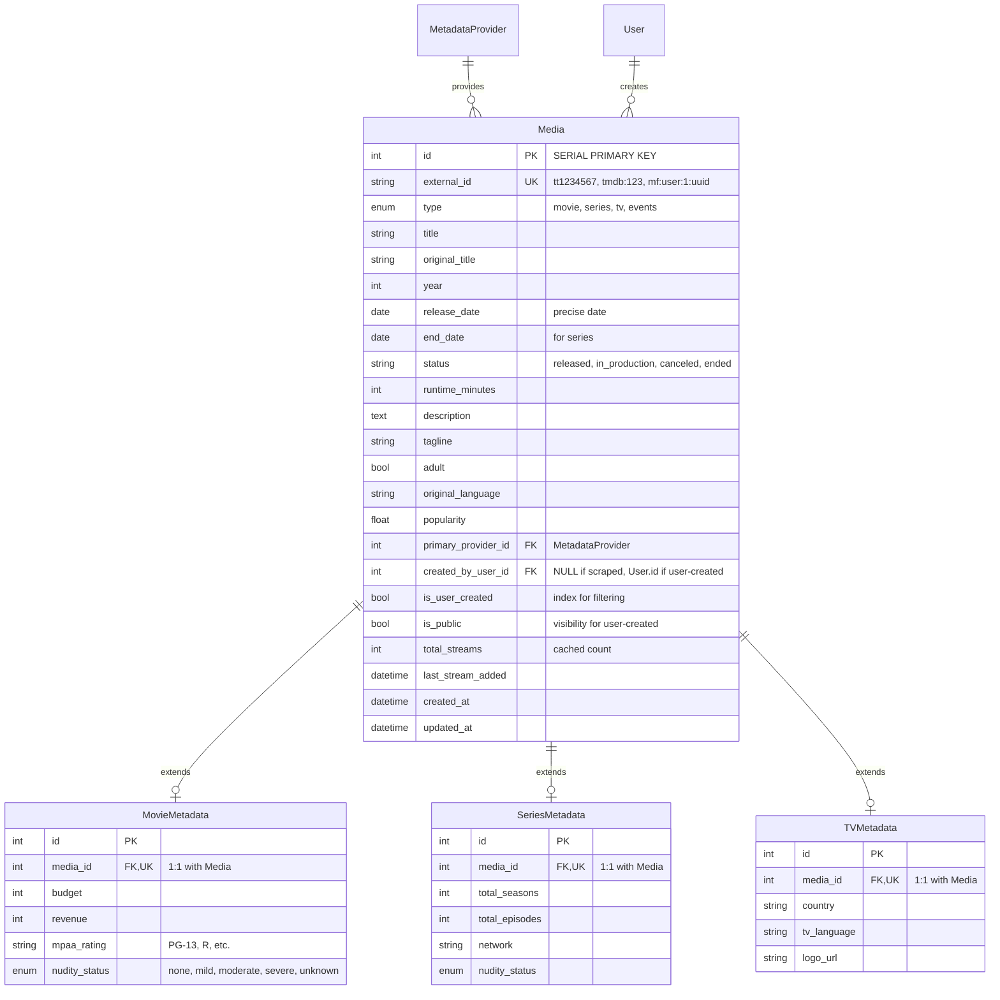
```mermaid
erDiagram
    Media {
        int id PK "SERIAL PRIMARY KEY"
        string external_id UK "tt1234567, tmdb:123, mf:user:1:uuid"
        enum type "movie, series, tv, events"
        string title
        string original_title
        int year
        date release_date "precise date"
        date end_date "for series"
        string status "released, in_production, canceled, ended"
        int runtime_minutes
        text description
        string tagline
        bool adult
        string original_language
        float popularity
        int primary_provider_id FK "MetadataProvider"
        int created_by_user_id FK "NULL if scraped, User.id if user-created"
        bool is_user_created "index for filtering"
        bool is_public "visibility for user-created"
        int total_streams "cached count"
        datetime last_stream_added
        datetime created_at
        datetime updated_at
    }
    
    MovieMetadata {
        int id PK
        int media_id FK, UK "1:1 with Media"
        int budget
        int revenue
        string mpaa_rating "PG-13, R, etc."
        enum nudity_status "none, mild, moderate, severe, unknown"
    }
    
    SeriesMetadata {
        int id PK
        int media_id FK, UK "1:1 with Media"
        int total_seasons
        int total_episodes
        string network
        enum nudity_status
    }
    
    TVMetadata {
        int id PK
        int media_id FK, UK "1:1 with Media"
        string country
        string tv_language
        string logo_url
    }
    
    %% Relationships
    MetadataProvider ||--o{ Media : "provides"
    User ||--o{ Media : "creates"
    Media ||--o| MovieMetadata : "extends"
    Media ||--o| SeriesMetadata : "extends"
    Media ||--o| TVMetadata : "extends"
```

---

## 3. Multi-Provider Metadata Cache

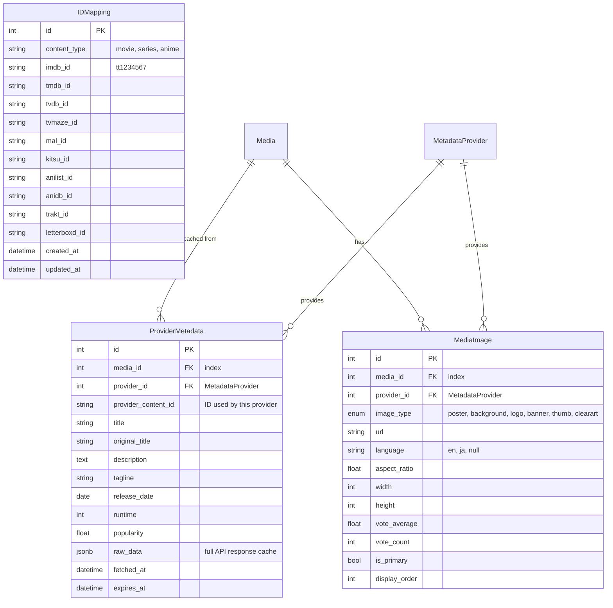
```mermaid
erDiagram
    ProviderMetadata {
        int id PK
        int media_id FK "index"
        int provider_id FK "MetadataProvider"
        string provider_content_id "ID used by this provider"
        string title
        string original_title
        text description
        string tagline
        date release_date
        int runtime
        float popularity
        jsonb raw_data "full API response cache"
        datetime fetched_at
        datetime expires_at
    }
    
    IDMapping {
        int id PK
        string content_type "movie, series, anime"
        string imdb_id "tt1234567"
        string tmdb_id
        string tvdb_id
        string tvmaze_id
        string mal_id
        string kitsu_id
        string anilist_id
        string anidb_id
        string trakt_id
        string letterboxd_id
        datetime created_at
        datetime updated_at
    }
    
    MediaImage {
        int id PK
        int media_id FK "index"
        int provider_id FK "MetadataProvider"
        enum image_type "poster, background, logo, banner, thumb, clearart"
        string url
        string language "en, ja, null"
        float aspect_ratio
        int width
        int height
        float vote_average
        int vote_count
        bool is_primary
        int display_order
    }
    
    %% Relationships
    Media ||--o{ ProviderMetadata : "cached from"
    Media ||--o{ MediaImage : "has"
    MetadataProvider ||--o{ ProviderMetadata : "provides"
    MetadataProvider ||--o{ MediaImage : "provides"
```

---

## 4. Multi-Provider Rating System

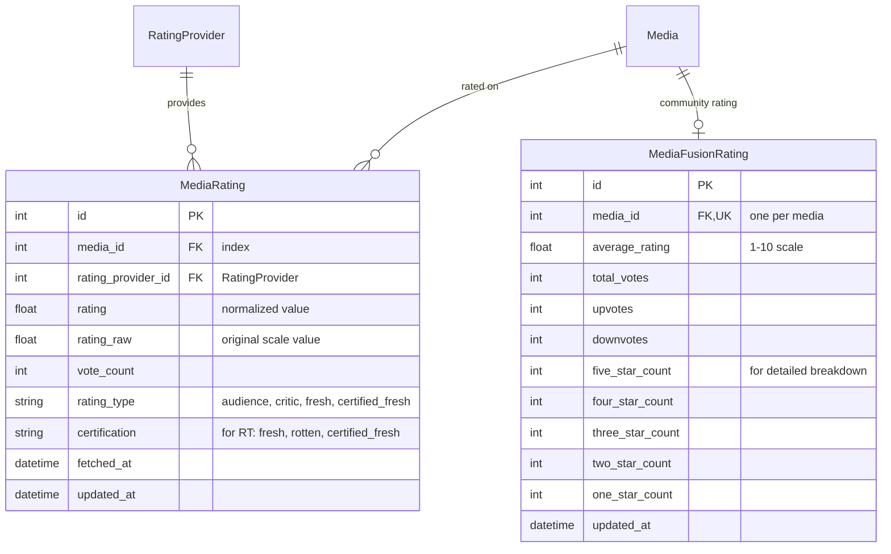
```mermaid
erDiagram
    MediaRating {
        int id PK
        int media_id FK "index"
        int rating_provider_id FK "RatingProvider"
        float rating "normalized value"
        float rating_raw "original scale value"
        int vote_count
        string rating_type "audience, critic, fresh, certified_fresh"
        string certification "for RT: fresh, rotten, certified_fresh"
        datetime fetched_at
        datetime updated_at
    }
    
    MediaFusionRating {
        int id PK
        int media_id FK, UK "one per media"
        float average_rating "1-10 scale"
        int total_votes
        int upvotes
        int downvotes
        int five_star_count "for detailed breakdown"
        int four_star_count
        int three_star_count
        int two_star_count
        int one_star_count
        datetime updated_at
    }
    
    %% Relationships
    Media ||--o{ MediaRating : "rated on"
    RatingProvider ||--o{ MediaRating : "provides"
    Media ||--o| MediaFusionRating : "community rating"
```

**Supported Rating Providers:**
| Provider | Max Rating | Type | Notes |
|----------|-----------|------|-------|
| IMDb | 10.0 | Numeric | User votes |
| TMDB | 10.0 | Numeric | User votes |
| Trakt | 10.0 | Numeric | User votes |
| Letterboxd | 5.0 | Numeric | User votes |
| Rotten Tomatoes | 100% | Percentage | Critic + Audience |
| Metacritic | 100 | Score | Critic + User |
| Roger Ebert | 4.0 | Stars | Critic |
| MediaFusion | 10.0 | Numeric | Community votes |

---

## 5. Series Structure

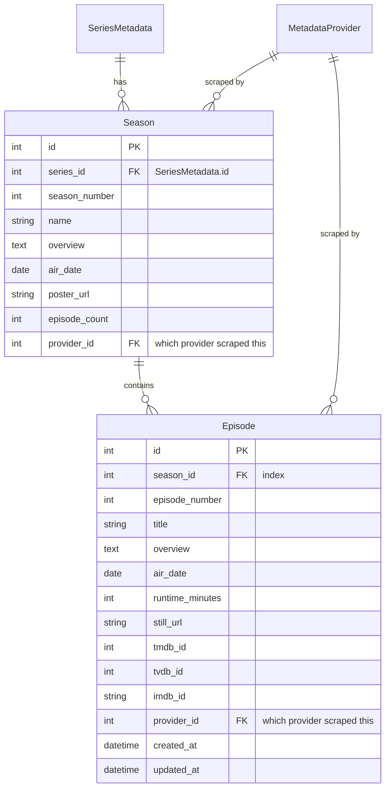
```mermaid
erDiagram
    Season {
        int id PK
        int series_id FK "SeriesMetadata.id"
        int season_number
        string name
        text overview
        date air_date
        string poster_url
        int episode_count
        int provider_id FK "which provider scraped this"
    }
    
    Episode {
        int id PK
        int season_id FK "index"
        int episode_number
        string title
        text overview
        date air_date
        int runtime_minutes
        string still_url
        int tmdb_id
        int tvdb_id
        string imdb_id
        int provider_id FK "which provider scraped this"
        datetime created_at
        datetime updated_at
    }
    
    %% Relationships
    SeriesMetadata ||--o{ Season : "has"
    Season ||--o{ Episode : "contains"
    MetadataProvider ||--o{ Season : "scraped by"
    MetadataProvider ||--o{ Episode : "scraped by"
```

**Note:** No `is_stub` field. Episodes auto-generated from stream parsing are attributed to "mediafusion" provider.

---

## 6. Unified Stream Architecture

### 6.1 Base Stream Table

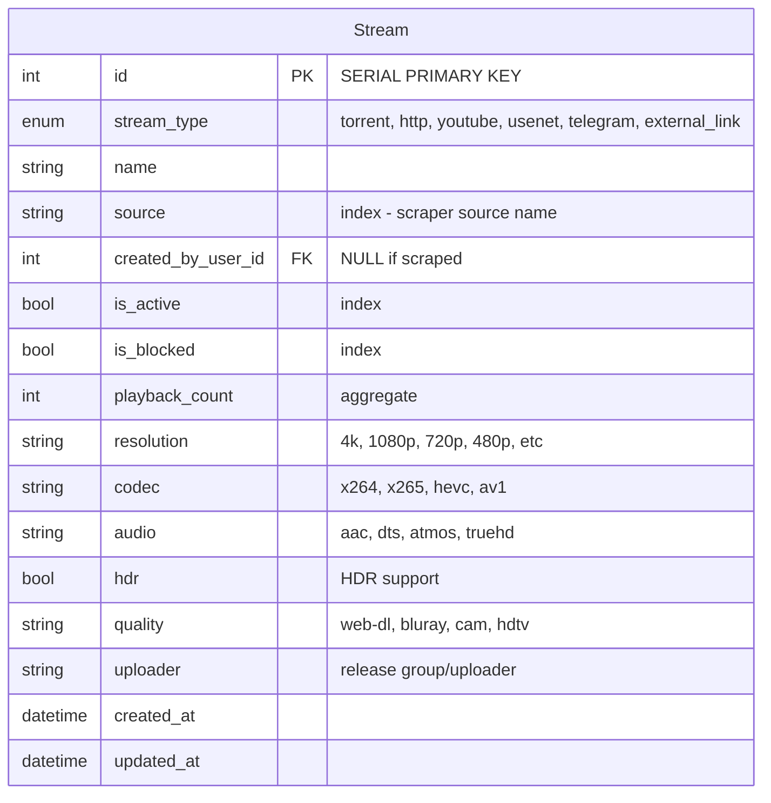
```mermaid
erDiagram
    Stream {
        int id PK "SERIAL PRIMARY KEY"
        enum stream_type "torrent, http, youtube, usenet, telegram, external_link"
        string name
        string source "index - scraper source name"
        int created_by_user_id FK "NULL if scraped"
        bool is_active "index"
        bool is_blocked "index"
        int playback_count "aggregate"
        string resolution "4k, 1080p, 720p, 480p, etc"
        string codec "x264, x265, hevc, av1"
        string audio "aac, dts, atmos, truehd"
        bool hdr "HDR support"
        string quality "web-dl, bluray, cam, hdtv"
        string uploader "release group/uploader"
        datetime created_at
        datetime updated_at
    }
```

### 6.2 Stream-Media Linking (Many-to-Many with File Granularity)

This is the **key table** for linking streams to metadata. It supports:
- **Single stream to single metadata** (normal case)
- **Single stream to multiple metadata** (multi-movie torrent pack)
- **Specific file within stream to specific metadata** (link file_index=2 to "Movie 2")
- **User-created links** (user links their torrent to their custom metadata)

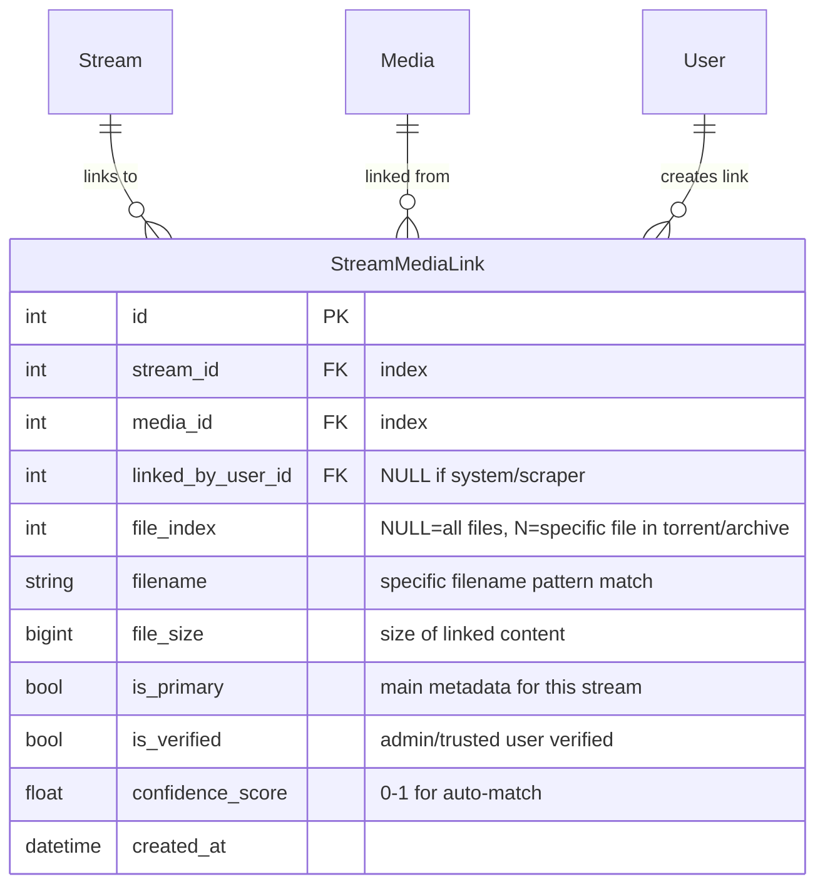
```mermaid
erDiagram
    StreamMediaLink {
        int id PK
        int stream_id FK "index"
        int media_id FK "index"
        int linked_by_user_id FK "NULL if system/scraper"
        int file_index "NULL=all files, N=specific file in torrent/archive"
        string filename "specific filename pattern match"
        bigint file_size "size of linked content"
        bool is_primary "main metadata for this stream"
        bool is_verified "admin/trusted user verified"
        float confidence_score "0-1 for auto-match"
        datetime created_at
    }
    
    %% Relationships
    Stream ||--o{ StreamMediaLink : "links to"
    Media ||--o{ StreamMediaLink : "linked from"
    User ||--o{ StreamMediaLink : "creates link"
```

**Examples:**
1. **Normal torrent**: 1 StreamMediaLink row (file_index=NULL, links whole torrent to media)
2. **Multi-movie pack** (3 movies in 1 torrent): 3 StreamMediaLink rows:
   - stream_id=1, media_id=100, file_index=0 (first movie)
   - stream_id=1, media_id=101, file_index=1 (second movie)
   - stream_id=1, media_id=102, file_index=2 (third movie)
3. **User custom link**: User creates their own metadata (media_id=200), links existing torrent to it via new StreamMediaLink

### 6.3 TorrentStream

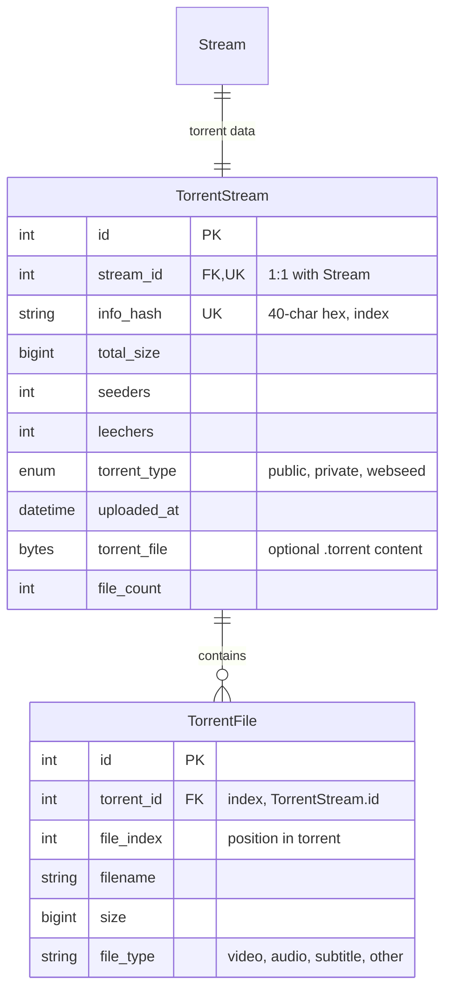
```mermaid
erDiagram
    TorrentStream {
        int id PK
        int stream_id FK, UK "1:1 with Stream"
        string info_hash UK "40-char hex, index"
        bigint total_size
        int seeders
        int leechers
        enum torrent_type "public, private, webseed"
        datetime uploaded_at
        bytes torrent_file "optional .torrent content"
        int file_count
    }
    
    TorrentFile {
        int id PK
        int torrent_id FK "index, TorrentStream.id"
        int file_index "position in torrent"
        string filename
        bigint size
        string file_type "video, audio, subtitle, other"
    }
    
    %% Relationships
    Stream ||--|| TorrentStream : "torrent data"
    TorrentStream ||--o{ TorrentFile : "contains"
```

### 6.4 Trackers (Optimized with Status)

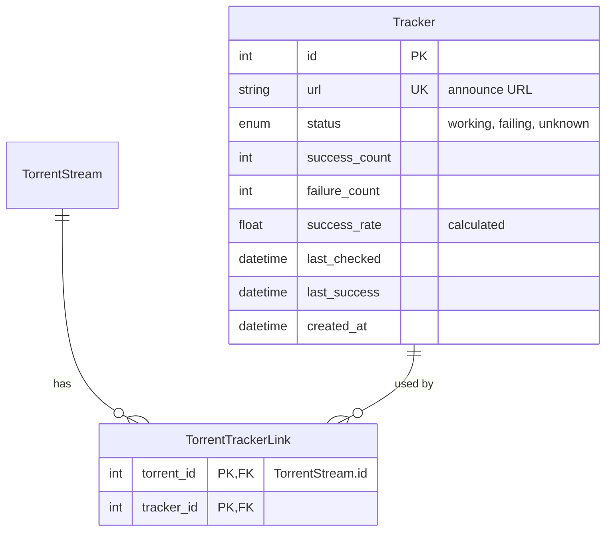
```mermaid
erDiagram
    Tracker {
        int id PK
        string url UK "announce URL"
        enum status "working, failing, unknown"
        int success_count
        int failure_count
        float success_rate "calculated"
        datetime last_checked
        datetime last_success
        datetime created_at
    }
    
    TorrentTrackerLink {
        int torrent_id PK, FK "TorrentStream.id"
        int tracker_id PK, FK
    }
    
    %% Relationships
    TorrentStream ||--o{ TorrentTrackerLink : "has"
    Tracker ||--o{ TorrentTrackerLink : "used by"
```

### 6.5 HTTPStream (Direct URLs)

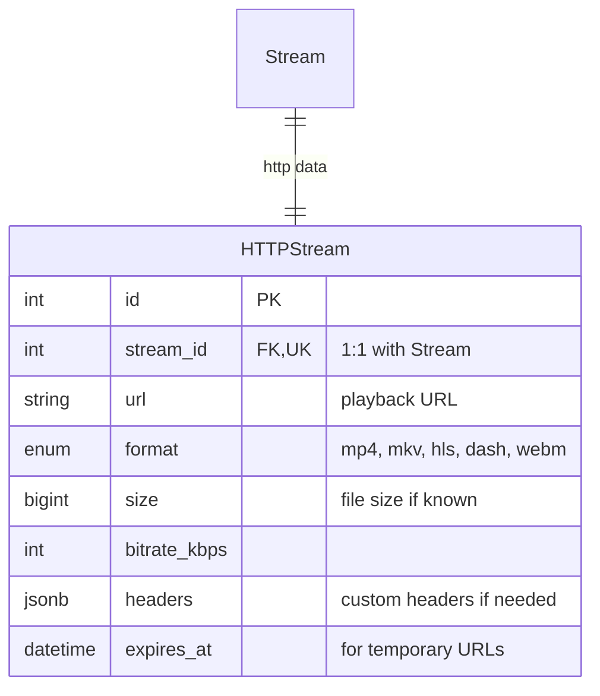
```mermaid
erDiagram
    HTTPStream {
        int id PK
        int stream_id FK, UK "1:1 with Stream"
        string url "playback URL"
        enum format "mp4, mkv, hls, dash, webm"
        bigint size "file size if known"
        int bitrate_kbps
        jsonb headers "custom headers if needed"
        datetime expires_at "for temporary URLs"
    }
    
    %% Relationships
    Stream ||--|| HTTPStream : "http data"
```

### 6.6 YouTubeStream

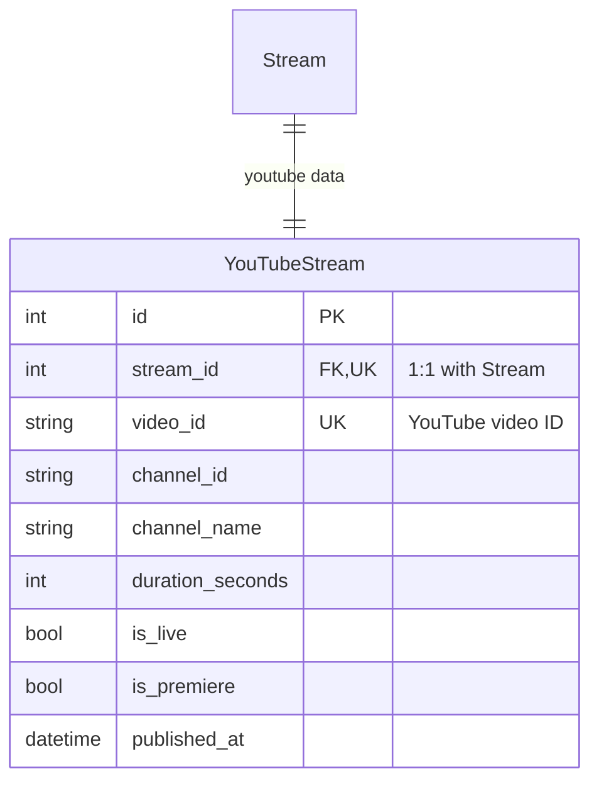
```mermaid
erDiagram
    YouTubeStream {
        int id PK
        int stream_id FK, UK "1:1 with Stream"
        string video_id UK "YouTube video ID"
        string channel_id
        string channel_name
        int duration_seconds
        bool is_live
        bool is_premiere
        datetime published_at
    }
    
    %% Relationships
    Stream ||--|| YouTubeStream : "youtube data"
```

### 6.7 UsenetStream

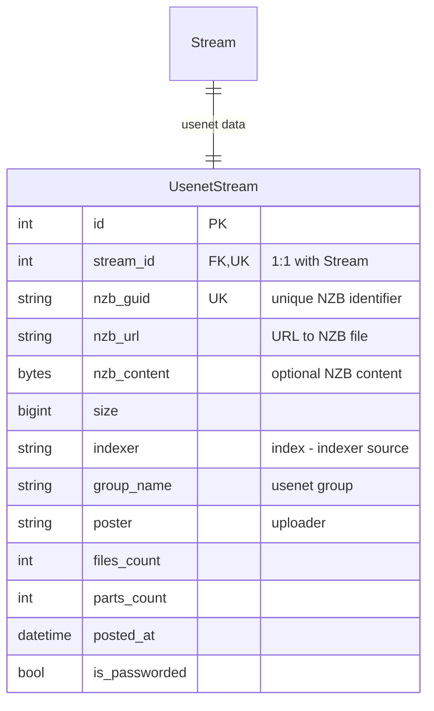
```mermaid
erDiagram
    UsenetStream {
        int id PK
        int stream_id FK, UK "1:1 with Stream"
        string nzb_guid UK "unique NZB identifier"
        string nzb_url "URL to NZB file"
        bytes nzb_content "optional NZB content"
        bigint size
        string indexer "index - indexer source"
        string group_name "usenet group"
        string poster "uploader"
        int files_count
        int parts_count
        datetime posted_at
        bool is_passworded
    }
    
    %% Relationships
    Stream ||--|| UsenetStream : "usenet data"
```

### 6.8 TelegramStream (Future)

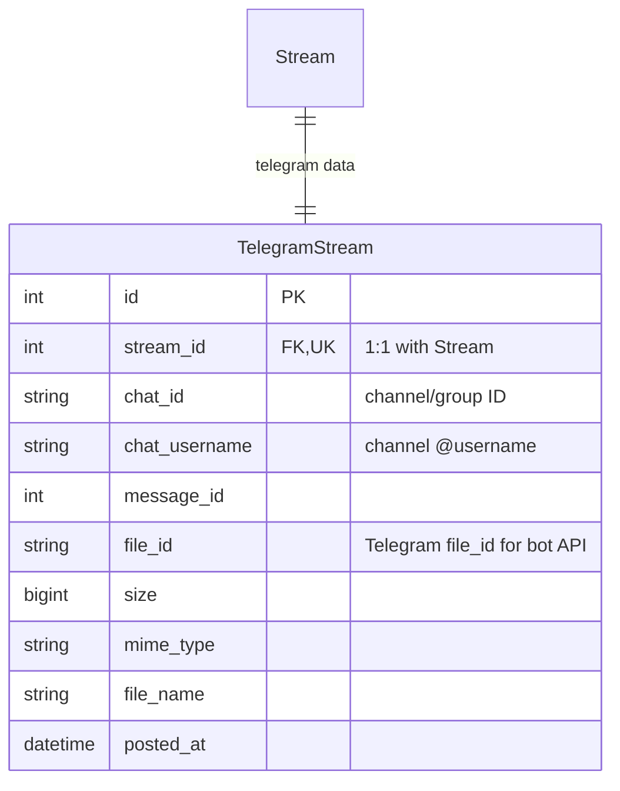
```mermaid
erDiagram
    TelegramStream {
        int id PK
        int stream_id FK, UK "1:1 with Stream"
        string chat_id "channel/group ID"
        string chat_username "channel @username"
        int message_id
        string file_id "Telegram file_id for bot API"
        bigint size
        string mime_type
        string file_name
        datetime posted_at
    }
    
    %% Relationships
    Stream ||--|| TelegramStream : "telegram data"
```

### 6.9 ExternalLinkStream (Netflix, Prime, Disney+, etc.)

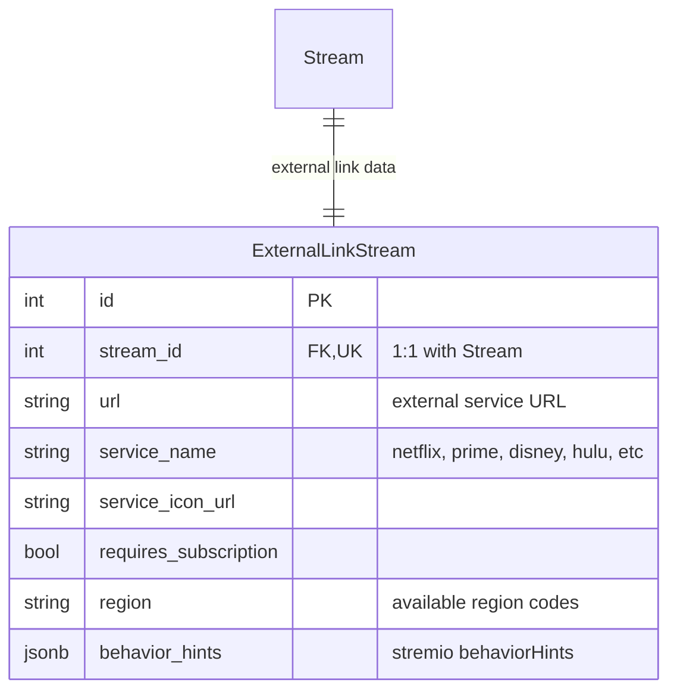
```mermaid
erDiagram
    ExternalLinkStream {
        int id PK
        int stream_id FK, UK "1:1 with Stream"
        string url "external service URL"
        string service_name "netflix, prime, disney, hulu, etc"
        string service_icon_url
        bool requires_subscription
        string region "available region codes"
        jsonb behavior_hints "stremio behaviorHints"
    }
    
    %% Relationships
    Stream ||--|| ExternalLinkStream : "external link data"
```

### 6.10 Episode Files (for series streams)

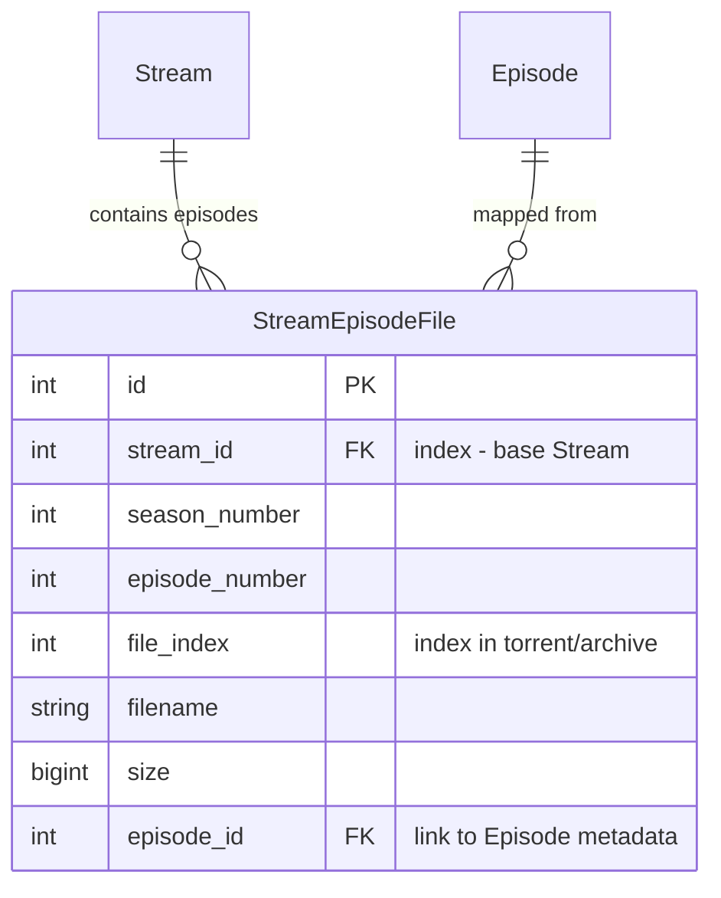
```mermaid
erDiagram
    StreamEpisodeFile {
        int id PK
        int stream_id FK "index - base Stream"
        int season_number
        int episode_number
        int file_index "index in torrent/archive"
        string filename
        bigint size
        int episode_id FK "link to Episode metadata"
    }
    
    %% Relationships
    Stream ||--o{ StreamEpisodeFile : "contains episodes"
    Episode ||--o{ StreamEpisodeFile : "mapped from"
```

### 6.11 Stream Languages (Common for all stream types)

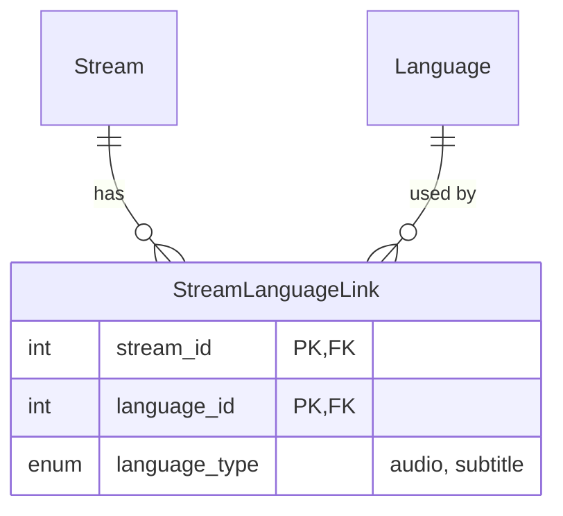
```mermaid
erDiagram
    StreamLanguageLink {
        int stream_id PK, FK
        int language_id PK, FK
        enum language_type "audio, subtitle"
    }
    
    %% Relationships
    Stream ||--o{ StreamLanguageLink : "has"
    Language ||--o{ StreamLanguageLink : "used by"
```

---

## 7. Reference Data


```mermaid
erDiagram
    Language {
        int id PK
        string code UK "en, ja, es"
        string name "English, Japanese, Spanish"
    }
    
    Genre {
        int id PK
        string name UK "index"
    }
    
    Catalog {
        int id PK
        string name UK
        string description
        bool is_system "system vs discoverable"
        int display_order
    }
    
    AkaTitle {
        int id PK
        int media_id FK "index"
        string title "index, with tsvector for search"
        string language_code
    }
    
    Keyword {
        int id PK
        string name UK "index"
    }
    
    ProductionCompany {
        int id PK
        string name "index"
        string logo_url
        string origin_country
        int tmdb_id UK
    }
    
    %% Link Tables
    MediaGenreLink {
        int media_id PK, FK
        int genre_id PK, FK
    }
    
    MediaCatalogLink {
        int media_id PK, FK
        int catalog_id PK, FK
    }
    
    MediaKeywordLink {
        int media_id PK, FK
        int keyword_id PK, FK
    }
    
    MediaProductionCompanyLink {
        int media_id PK, FK
        int company_id PK, FK
    }
    
    StreamLanguageLink {
        int stream_id PK, FK
        int language_id PK, FK
    }
```

---

## 8. Cast and Crew

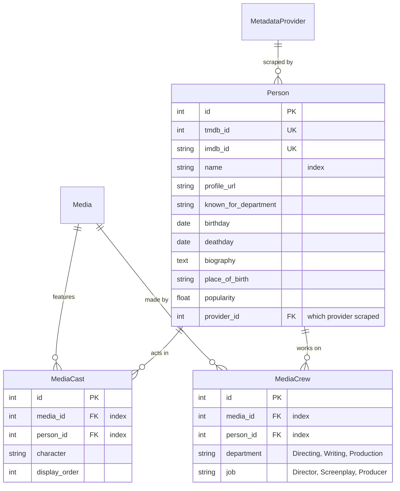
```mermaid
erDiagram
    Person {
        int id PK
        int tmdb_id UK
        string imdb_id UK
        string name "index"
        string profile_url
        string known_for_department
        date birthday
        date deathday
        text biography
        string place_of_birth
        float popularity
        int provider_id FK "which provider scraped"
    }
    
    MediaCast {
        int id PK
        int media_id FK "index"
        int person_id FK "index"
        string character
        int display_order
    }
    
    MediaCrew {
        int id PK
        int media_id FK "index"
        int person_id FK "index"
        string department "Directing, Writing, Production"
        string job "Director, Screenplay, Producer"
    }
    
    %% Relationships
    Media ||--o{ MediaCast : "features"
    Person ||--o{ MediaCast : "acts in"
    Media ||--o{ MediaCrew : "made by"
    Person ||--o{ MediaCrew : "works on"
    MetadataProvider ||--o{ Person : "scraped by"
```

---

## 9. Reviews

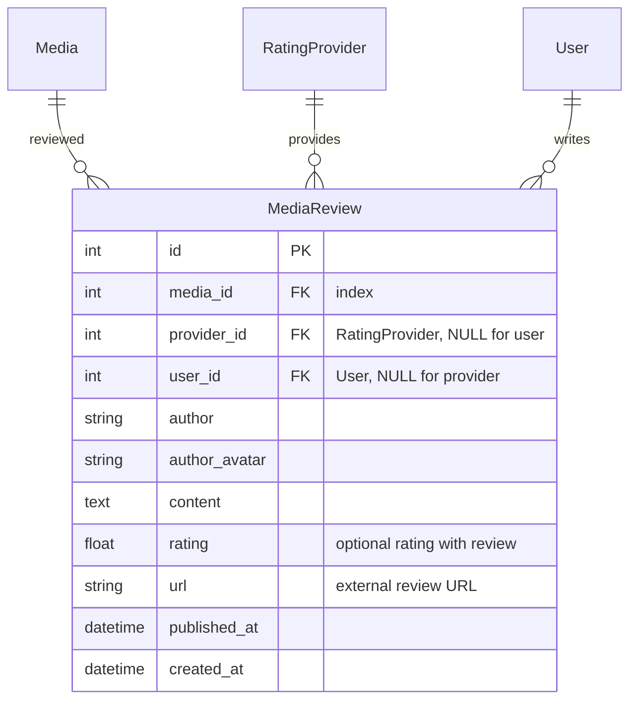
```mermaid
erDiagram
    MediaReview {
        int id PK
        int media_id FK "index"
        int provider_id FK "RatingProvider, NULL for user"
        int user_id FK "User, NULL for provider"
        string author
        string author_avatar
        text content
        float rating "optional rating with review"
        string url "external review URL"
        datetime published_at
        datetime created_at
    }
    
    %% Relationships
    Media ||--o{ MediaReview : "reviewed"
    RatingProvider ||--o{ MediaReview : "provides"
    User ||--o{ MediaReview : "writes"
```

---

## 10. User System

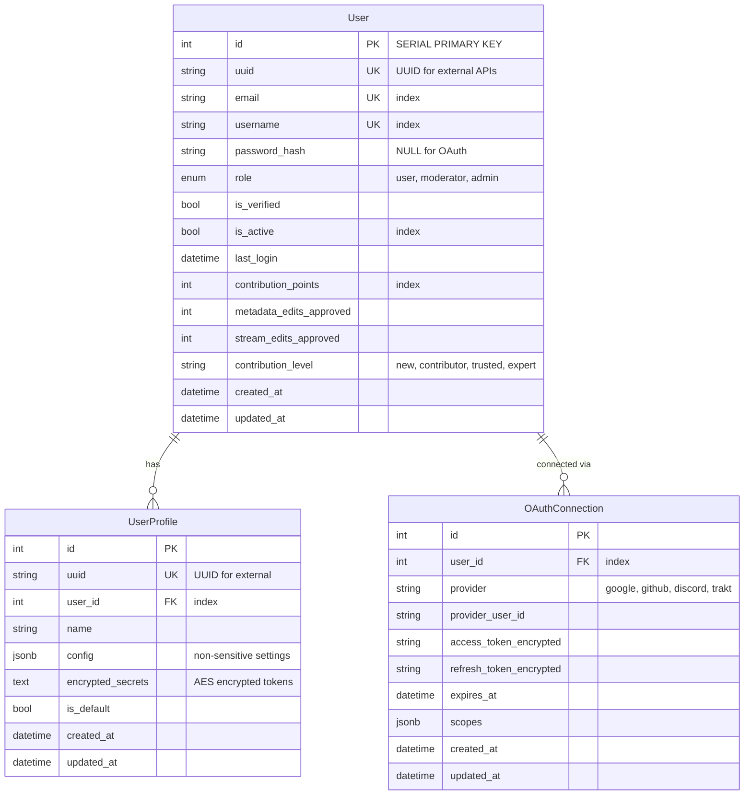
```mermaid
erDiagram
    User {
        int id PK "SERIAL PRIMARY KEY"
        string uuid UK "UUID for external APIs"
        string email UK "index"
        string username UK "index"
        string password_hash "NULL for OAuth"
        enum role "user, moderator, admin"
        bool is_verified
        bool is_active "index"
        datetime last_login
        int contribution_points "index"
        int metadata_edits_approved
        int stream_edits_approved
        string contribution_level "new, contributor, trusted, expert"
        datetime created_at
        datetime updated_at
    }
    
    UserProfile {
        int id PK
        string uuid UK "UUID for external"
        int user_id FK "index"
        string name
        jsonb config "non-sensitive settings"
        text encrypted_secrets "AES encrypted tokens"
        bool is_default
        datetime created_at
        datetime updated_at
    }
    
    OAuthConnection {
        int id PK
        int user_id FK "index"
        string provider "google, github, discord, trakt"
        string provider_user_id
        string access_token_encrypted
        string refresh_token_encrypted
        datetime expires_at
        jsonb scopes
        datetime created_at
        datetime updated_at
    }
    
    %% Relationships
    User ||--o{ UserProfile : "has"
    User ||--o{ OAuthConnection : "connected via"
```

---

## 11. User Activity

```mermaid
erDiagram
    WatchHistory {
        int id PK
        int user_id FK "index"
        int profile_id FK "index"
        int media_id FK "index"
        string title_cached
        string media_type
        int season
        int episode
        int progress_seconds
        int duration_seconds
        datetime watched_at "index"
    }
    
    DownloadHistory {
        int id PK
        int user_id FK "index"
        int profile_id FK "index"
        int media_id FK "index"
        int stream_id FK "which stream was downloaded"
        string title_cached
        string media_type
        int season
        int episode
        jsonb stream_info
        enum status "completed, failed, canceled"
        datetime downloaded_at "index"
    }
    
    PlaybackTracking {
        int id PK
        int user_id FK "index, nullable"
        int profile_id FK "nullable"
        int stream_id FK "index"
        int media_id FK "index"
        int season
        int episode
        string provider_name "debrid provider"
        string provider_service
        datetime first_played_at
        datetime last_played_at
        int play_count
    }
    
    %% Relationships
    User ||--o{ WatchHistory : "watched"
    UserProfile ||--o{ WatchHistory : "tracked in"
    User ||--o{ DownloadHistory : "downloaded"
    UserProfile ||--o{ DownloadHistory : "tracked in"
    Stream ||--o{ DownloadHistory : "was downloaded"
    User ||--o{ PlaybackTracking : "played"
    Stream ||--o{ PlaybackTracking : "was played"
```

---

## 12. User Content & Catalogs

```mermaid
erDiagram
    UserCatalog {
        int id PK
        int user_id FK "owner, index"
        string name
        text description
        string poster_url
        bool is_public "index"
        bool is_listed "discoverable"
        string share_code UK "for sharing"
        int item_count "cached"
        int subscriber_count "cached"
        datetime created_at
        datetime updated_at
    }
    
    UserCatalogItem {
        int id PK
        int catalog_id FK "index"
        int media_id FK "index"
        int display_order "index"
        text notes
        datetime added_at
    }
    
    UserCatalogSubscription {
        int id PK
        int user_id FK "subscriber, index"
        int catalog_id FK "index"
        datetime subscribed_at
    }
    
    UserLibraryItem {
        int id PK
        int user_id FK "index"
        int media_id FK "index"
        string catalog_type "movie, series, tv"
        string title_cached
        string poster_cached
        datetime added_at "index"
    }
    
    %% Relationships
    User ||--o{ UserCatalog : "creates"
    UserCatalog ||--o{ UserCatalogItem : "contains"
    Media ||--o{ UserCatalogItem : "in"
    User ||--o{ UserCatalogSubscription : "subscribes"
    UserCatalog ||--o{ UserCatalogSubscription : "has"
    User ||--o{ UserLibraryItem : "saves"
```

---

## 13. Contributions & Voting

```mermaid
erDiagram
    Contribution {
        int id PK
        int user_id FK "index"
        string contribution_type "metadata, stream"
        int target_media_id FK "nullable"
        int target_stream_id FK "nullable"
        jsonb data "contribution details"
        enum status "pending, approved, rejected"
        int reviewed_by_id FK
        datetime reviewed_at
        text review_notes
        datetime created_at
        datetime updated_at
    }
    
    StreamVote {
        int id PK
        int user_id FK "index"
        int stream_id FK "index - works for ALL stream types"
        enum vote_type "up, down"
        string quality_status "working, broken, good, poor"
        text comment
        datetime created_at
        datetime updated_at
    }
    
    MetadataVote {
        int id PK
        int user_id FK "index"
        int media_id FK "index"
        int rating "1-10 scale"
        datetime created_at
        datetime updated_at
    }
    
    MetadataSuggestion {
        int id PK
        int user_id FK "index"
        int media_id FK "index"
        string field_name
        text current_value
        text suggested_value
        text reason
        enum status "pending, approved, rejected"
        int reviewed_by_id FK
        datetime reviewed_at
        text review_notes
        datetime created_at
        datetime updated_at
    }
    
    StreamSuggestion {
        int id PK
        int user_id FK "index"
        int stream_id FK "index"
        string suggestion_type "report_broken, quality, language"
        text current_value
        text suggested_value
        text reason
        enum status "pending, approved, rejected"
        int reviewed_by_id FK
        datetime reviewed_at
        text review_notes
        datetime created_at
        datetime updated_at
    }
    
    ContributionSettings {
        string id PK "default"
        int auto_approval_threshold
        int points_per_metadata_edit
        int points_per_stream_edit
        int points_for_rejection_penalty
        int contributor_threshold
        int trusted_threshold
        int expert_threshold
        bool allow_auto_approval
        bool require_reason_for_edits
        int max_pending_per_user
    }
```

---

## 14. RSS Feeds

```mermaid
erDiagram
    RSSFeed {
        int id PK
        string name "index"
        string url UK
        enum feed_type "torrent, usenet, direct"
        bool active "index"
        datetime last_scraped
        string source "index"
        string stream_type "public, private, webseed"
        bool auto_detect_catalog
        jsonb parsing_patterns
        jsonb filters
        jsonb metrics
        datetime created_at
        datetime updated_at
    }
    
    RSSFeedCatalogPattern {
        int id PK
        int feed_id FK "index"
        string name
        string regex
        bool enabled
        bool case_sensitive
        jsonb target_catalogs
    }
    
    UserRSSFeed {
        int id PK
        string uuid UK
        int user_id FK "index"
        string name
        string url
        enum feed_type "torrent, usenet, direct"
        bool is_active "index"
        string source "index"
        string stream_type
        bool auto_detect_catalog
        jsonb parsing_patterns
        jsonb filters
        jsonb metrics
        datetime last_scraped_at
        datetime created_at
        datetime updated_at
    }
    
    UserRSSFeedCatalogPattern {
        int id PK
        string uuid UK
        int feed_id FK "index"
        string name
        string regex
        bool enabled
        bool case_sensitive
        jsonb target_catalogs
    }
    
    %% Relationships
    RSSFeed ||--o{ RSSFeedCatalogPattern : "has"
    User ||--o{ UserRSSFeed : "owns"
    UserRSSFeed ||--o{ UserRSSFeedCatalogPattern : "has"
```

---

## 15. Statistics & Caching

```mermaid
erDiagram
    CatalogStreamStats {
        int media_id PK, FK
        int catalog_id PK, FK
        int total_streams
        datetime last_stream_added
    }
    
    DailyStats {
        int id PK
        date stat_date UK
        int new_users
        int active_users
        int new_streams
        int total_playbacks
        jsonb top_media "top 10 by playback"
        jsonb top_streams "top 10 by playback"
        datetime created_at
    }
```

---

## 16. AI Search (Future)

```mermaid
erDiagram
    AISearchConfig {
        int id PK
        int user_id FK, UK
        text gemini_api_key_encrypted
        bool is_enabled
        string model_preference "gemini-2.5-flash-lite"
        int daily_query_limit
        int queries_today
        date queries_reset_date
    }
    
    AISearchQuery {
        int id PK
        int user_id FK "nullable, index"
        string query
        string media_type
        int results_count
        int execution_time_ms
        jsonb results_summary
        datetime created_at
    }
```

---

## Summary

### Table Count by Category

| Category | Tables | Description |
|----------|--------|-------------|
| Providers | 2 | MetadataProvider, RatingProvider |
| Core Media | 4 | Media, MovieMetadata, SeriesMetadata, TVMetadata |
| Provider Cache | 3 | ProviderMetadata, IDMapping, MediaImage |
| Ratings | 2 | MediaRating (multi-provider), MediaFusionRating |
| Series | 2 | Season, Episode |
| **Streams (Base)** | 1 | **Stream (base table with quality attributes)** |
| **Stream Types** | 6 | **TorrentStream, HTTPStream, YouTubeStream, UsenetStream, TelegramStream, ExternalLinkStream** |
| **Torrent Support** | 3 | **TorrentFile, Tracker, TorrentTrackerLink** |
| Stream Links | 3 | StreamMediaLink, StreamLanguageLink, StreamEpisodeFile |
| Reference | 6 | Language, Genre, Catalog, AkaTitle, Keyword, ProductionCompany |
| Link Tables | 4 | MediaGenreLink, MediaCatalogLink, MediaKeywordLink, MediaProductionCompanyLink |
| Cast/Crew | 3 | Person, MediaCast, MediaCrew |
| Reviews | 1 | MediaReview |
| Users | 3 | User, UserProfile, OAuthConnection |
| User Activity | 3 | WatchHistory, DownloadHistory, PlaybackTracking |
| User Content | 4 | UserCatalog, UserCatalogItem, UserCatalogSubscription, UserLibraryItem |
| Contributions | 6 | Contribution, StreamVote, MetadataVote, MetadataSuggestion, StreamSuggestion, ContributionSettings |
| RSS | 4 | RSSFeed, RSSFeedCatalogPattern, UserRSSFeed, UserRSSFeedCatalogPattern |
| Stats | 2 | CatalogStreamStats, DailyStats |
| AI Search | 2 | AISearchConfig, AISearchQuery |
| **Total** | **~58 tables** | |

---

## Key Design Decisions

### 1. Unified Stream Architecture
Single `Stream` base table with type-specific tables:
- `TorrentStream` - BitTorrent with info_hash
- `HTTPStream` - Direct HTTP/HLS/DASH URLs
- `YouTubeStream` - YouTube videos
- `UsenetStream` - NZB/Usenet
- `TelegramStream` - Telegram channels (future)
- `ExternalLinkStream` - Netflix/Prime/Disney+ links

### 2. Explicit Quality Attributes (Not JSONB)
Stream base table has explicit columns:
- `resolution` (4k, 1080p, 720p, etc.)
- `codec` (x264, x265, hevc, av1)
- `audio` (aac, dts, atmos, truehd)
- `hdr` (boolean)
- `quality` (web-dl, bluray, cam, hdtv)

### 3. Tracker Status Tracking
Separate `Tracker` table with:
- Status (working, failing, unknown)
- Success/failure counts
- Last checked timestamp
- Enables tracker health monitoring

### 4. Multi-Provider Rating System
Supports 8+ rating providers:
- IMDb, TMDB, Trakt, Letterboxd, Rotten Tomatoes, Metacritic, Roger Ebert
- MediaFusion community ratings in `MediaFusionRating`

### 5. No `is_stub` Flag
Episodes/metadata auto-generated from streams are attributed to "mediafusion" provider.

### 6. MediaFusion as Provider
User-created metadata uses `primary_provider_id` pointing to "mediafusion" provider.

### 7. Many-to-Many Stream-Media via `StreamMediaLink`
- **file_index** - Links specific file in torrent to specific metadata
- **Multi-movie packs** - One torrent, multiple StreamMediaLink rows
- **User links** - Users can link any stream to their custom metadata
- **Works for ALL stream types**

### 8. `id` Naming Convention
All primary keys use `id`, all foreign keys use `{table}_id`.
