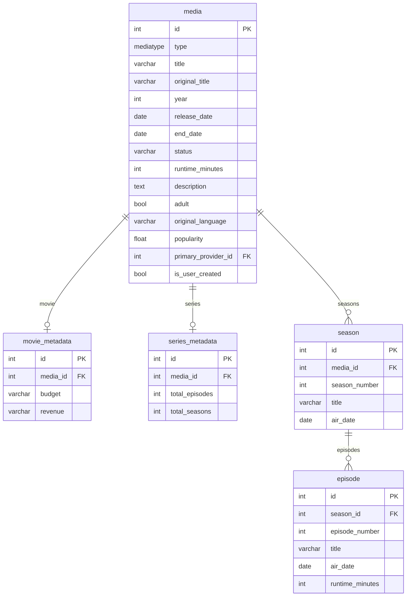
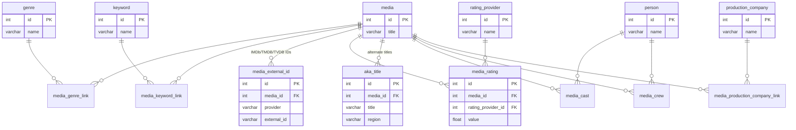
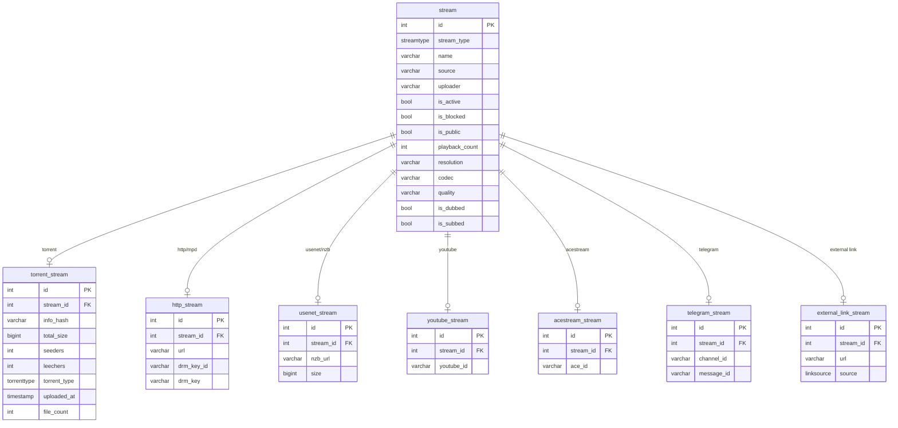
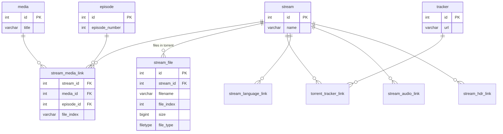
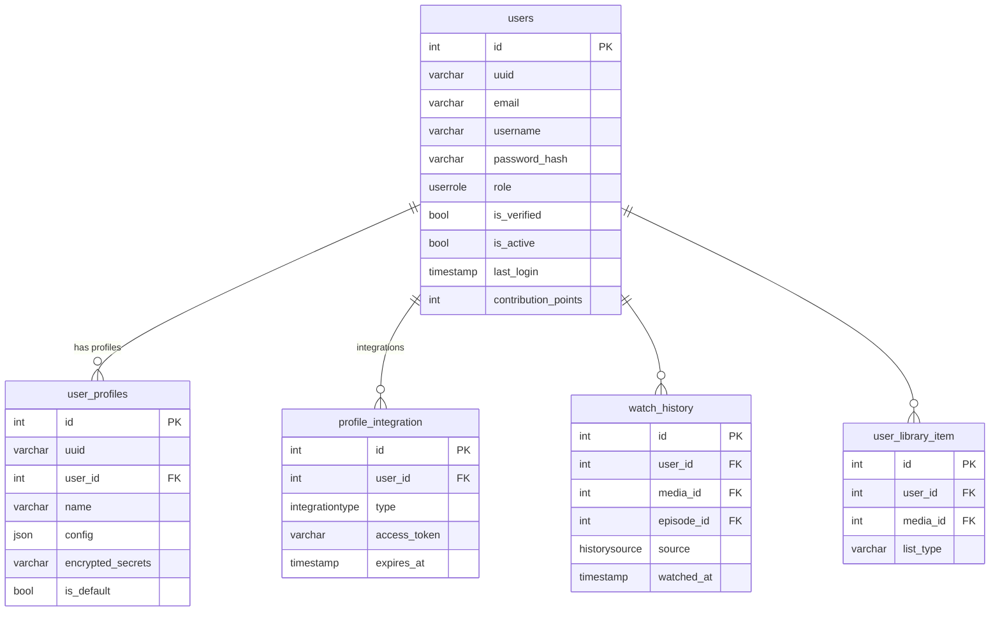
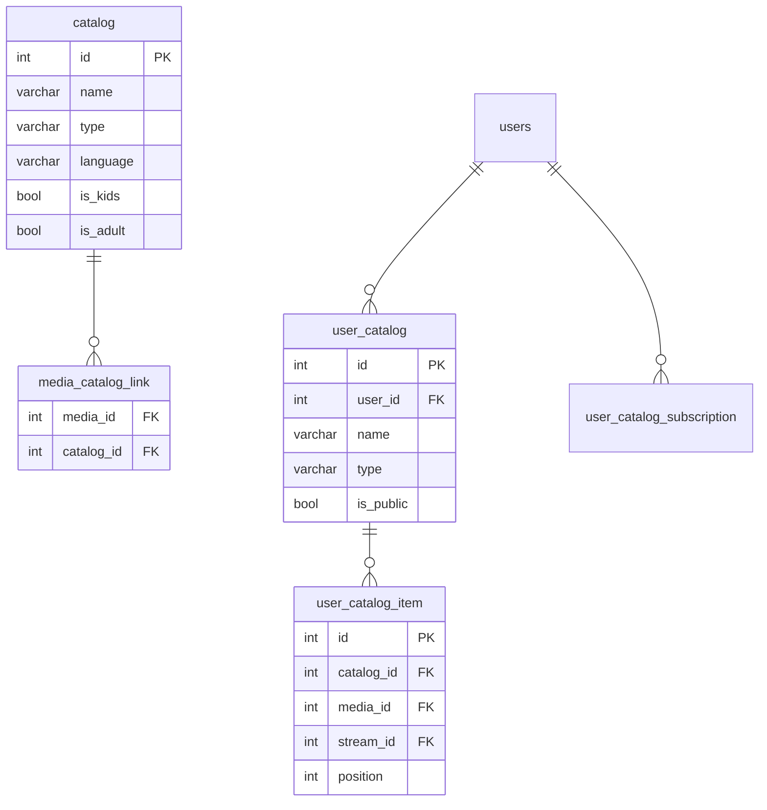
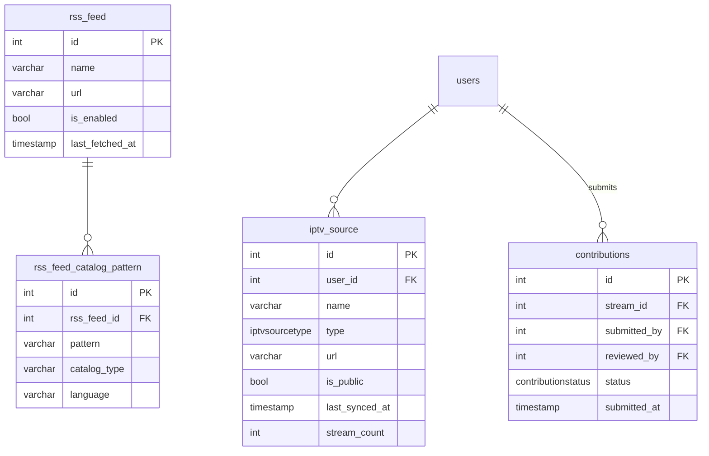

# Database Schema

MediaFusion 6.0 uses PostgreSQL. The schema is managed with **sqlx** migrations (`backend/migrations/`). Migrations apply automatically at startup.

!!! note "Current baseline"
    The schema described here reflects the 6.0 baseline (`0001_baseline.up.sql`) plus incremental migrations through `0013`. Check `backend/migrations/` for the latest changes.

---

## Core Domain: Media

The `media` table is the central entity. All movies, series, and other content hang off it.

---

## Media Associations

---

## Stream Architecture

MediaFusion uses a **base stream + type-specific extension** pattern. Every stream has a row in the base `stream` table plus exactly one row in a type table.

### Stream ↔ Media links

---

## Users & Profiles

---

## Catalog System

---

## IPTV, RSS, and Contributions

